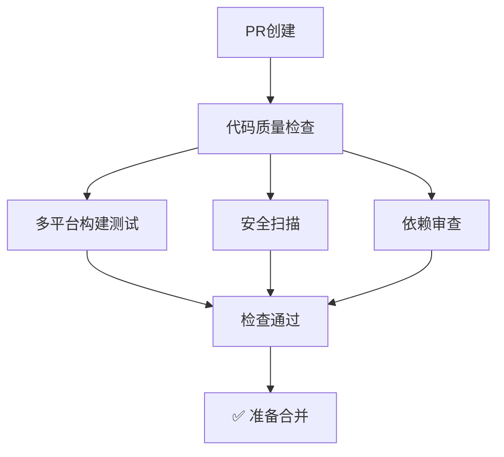
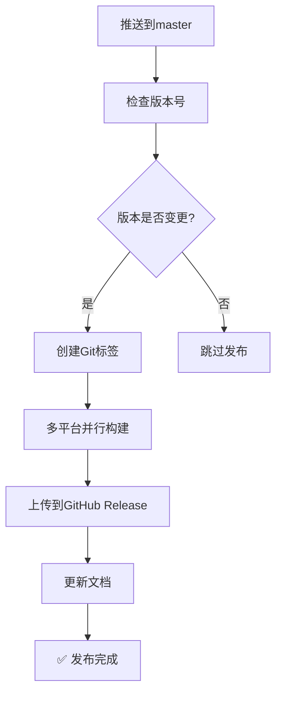

# GitHub Actions 自动构建和发布配置

本文档详细说明了Switch CC项目的GitHub Actions配置，实现了自动化的CI/CD流程。

## 🎯 配置概览

### 📁 Workflow文件结构
```
.github/
├── workflows/
│   ├── ci.yml              # 持续集成（PR检查）
│   ├── auto-release.yml    # 自动发布（master推送触发）
│   └── release.yml         # 手动发布（标签触发）
├── ISSUE_TEMPLATE/
│   ├── bug_report.yml      # Bug报告模板
│   └── feature_request.yml # 功能请求模板
├── pull_request_template.md # PR模板
└── tauri.conf.release.json # 发布专用配置
```

## 🚀 自动化流程

### 1. **持续集成 (CI)**
**触发条件**: Pull Request 到 master/main 分支

**流程步骤**:


**检查项目**:
- ✅ TypeScript类型检查
- ✅ 代码格式检查（Prettier）
- ✅ Rust格式检查（rustfmt）
- ✅ Rust代码质量检查（clippy）
- ✅ 跨平台构建测试（macOS, Windows, Linux）
- ✅ 依赖安全扫描
- ✅ 依赖变更审查

### 2. **自动发布 (Auto Release)**
**触发条件**: 推送到 master/main 分支（排除文档和配置变更）

**流程步骤**:


**构建平台**:
- 🍎 **macOS**: Universal Binary (Intel + Apple Silicon)
- 🪟 **Windows**: x64 安装程序
- 🐧 **Linux**: AppImage + DEB 包

### 3. **手动发布 (Manual Release)**
**触发条件**: 推送Git标签 (格式: `v*`)

用于特殊版本或热修复的手动发布流程。

## 🔧 配置详解

### CI Workflow (`ci.yml`)

#### 代码质量检查
```yaml
lint-and-format:
  - TypeScript类型检查: pnpm typecheck
  - 代码格式检查: pnpm format:check  
  - Rust格式检查: cargo fmt --check
  - Rust质量检查: cargo clippy
```

#### 构建测试
```yaml
build-test:
  strategy:
    matrix:
      platform: [ubuntu-latest, macos-latest, windows-latest]
  steps:
    - 安装依赖
    - 构建前端
    - Rust编译检查
    - 运行测试
```

#### 安全扫描
```yaml
security-audit:
  - npm安全扫描: pnpm audit
  - Rust安全扫描: cargo audit
```

### 自动发布 Workflow (`auto-release.yml`)

#### 版本检查逻辑
```yaml
check-version:
  # 1. 从package.json读取当前版本
  # 2. 检查对应的Git标签是否存在
  # 3. 如果标签不存在，标记需要发布
```

#### 多平台构建
```yaml
build-release:
  strategy:
    matrix:
      include:
        - platform: 'macos-latest'
          args: '--target universal-apple-darwin'
        - platform: 'ubuntu-22.04'  
          args: '--target x86_64-unknown-linux-gnu'
        - platform: 'windows-latest'
          args: '--target x86_64-pc-windows-msvc'
```

## 📦 发布产物

### 构建产物清单
| 平台 | 文件格式 | 说明 |
|------|---------|------|
| **macOS** | `.dmg` | 包含Universal Binary的磁盘镜像 |
| **Windows** | `.exe` | NSIS安装程序 |
| **Linux** | `.AppImage` | 便携式应用镜像 |
| **Linux** | `.deb` | Debian/Ubuntu安装包 |

### 文件命名规范
```
Switch-CC_{version}_{platform}_{arch}.{ext}

例如:
- Switch-CC_1.0.0_universal-apple-darwin.dmg
- Switch-CC_1.0.0_x64-setup.exe
- switch-cc_1.0.0_amd64.AppImage
- switch-cc_1.0.0_amd64.deb
```

## 🔐 安全配置

### 必需的Secrets

| Secret名称 | 用途 | 必需 |
|-----------|------|------|
| `GITHUB_TOKEN` | GitHub API访问 | ✅ 必需 |
| `APPLE_CERTIFICATE` | macOS代码签名 | 可选 |
| `APPLE_CERTIFICATE_PASSWORD` | 证书密码 | 可选 |
| `APPLE_SIGNING_IDENTITY` | 签名身份 | 可选 |

### Secrets配置方法
1. 进入仓库设置 → Secrets and variables → Actions
2. 点击 "New repository secret"
3. 添加上述必需的secrets

## 🎚️ 高级配置

### 平台特定优化

#### macOS配置
```yaml
# 支持Universal Binary（同时支持Intel和Apple Silicon）
args: '--target universal-apple-darwin'

# 代码签名（需要Apple Developer证书）
env:
  APPLE_CERTIFICATE: ${{ secrets.APPLE_CERTIFICATE }}
  APPLE_SIGNING_IDENTITY: ${{ secrets.APPLE_SIGNING_IDENTITY }}
```

#### Linux配置
```yaml
# 系统依赖安装
- name: Install Linux dependencies
  run: |
    sudo apt-get update
    sudo apt-get install -y \
      libwebkit2gtk-4.1-dev \
      libgtk-3-dev \
      libayatana-appindicator3-dev
```

#### Windows配置
```yaml
# Windows特定构建参数
args: '--target x86_64-pc-windows-msvc'

# NSIS安装程序配置
nsis:
  installMode: perMachine
  createDesktopShortcut: true
  runAfterFinish: true
```

### 构建优化

#### 并行构建
```yaml
strategy:
  fail-fast: false  # 一个平台失败不影响其他平台
  matrix:
    include: [...] # 多平台并行构建
```

#### 缓存策略
```yaml
- name: Setup Node.js
  uses: actions/setup-node@v4
  with:
    cache: 'npm'  # 缓存Node.js依赖

- name: Setup Rust
  uses: dtolnay/rust-toolchain@stable
  # Rust工具链自动缓存
```

## 📊 监控和调试

### 构建状态徽章
添加到README.md:
```markdown


```

### 日志查看
1. 进入GitHub仓库 → Actions标签
2. 选择对应的workflow运行
3. 点击具体的job查看详细日志

### 常见问题排查

#### 构建失败
- **依赖问题**: 检查`pnpm-lock.yaml`是否最新
- **平台兼容性**: 检查是否安装了必需的系统依赖
- **代码质量**: 运行本地检查命令确保代码符合规范

#### 发布失败
- **权限问题**: 确认`GITHUB_TOKEN`有足够权限
- **版本冲突**: 检查是否存在相同版本的标签
- **签名问题**: 检查代码签名证书配置

## 🚦 使用指南

### 开发者工作流

#### 1. 功能开发
```bash
# 1. 创建功能分支
git checkout -b feature/new-feature

# 2. 开发和测试
pnpm dev
pnpm typecheck
pnpm format

# 3. 提交代码
git add .
git commit -m "feat: add new feature"
git push origin feature/new-feature

# 4. 创建PR
# GitHub上创建Pull Request到master分支
```

#### 2. 版本发布
```bash
# 1. 更新版本号
# 编辑package.json中的version字段
# 编辑src-tauri/Cargo.toml中的version字段

# 2. 提交版本变更
git add package.json src-tauri/Cargo.toml
git commit -m "chore: bump version to v1.1.0"

# 3. 推送到master
git push origin master
# 自动触发构建和发布
```

#### 3. 热修复发布
```bash
# 1. 创建标签进行紧急发布
git tag v1.0.1
git push origin v1.0.1
# 触发手动发布流程
```

### 维护者操作

#### 管理Release
1. **编辑Release**: 在GitHub Release页面编辑描述
2. **删除Release**: 如需重新发布，先删除标签和Release
3. **预发布版本**: 在Release中标记为"Pre-release"

#### 监控构建
1. **定期检查**: 关注Actions页面的构建状态
2. **性能监控**: 观察构建时间趋势，适时优化
3. **依赖更新**: 定期更新Actions版本和依赖

## 🎯 最佳实践

### 版本管理
- **语义化版本**: 遵循SemVer规范 (major.minor.patch)
- **变更日志**: 每次发布更新CHANGELOG.md
- **标签规范**: 使用`v`前缀的版本标签

### 代码质量
- **Pre-commit检查**: 推送前运行本地检查
- **增量构建**: 只有相关文件变更时才触发构建
- **测试覆盖**: 确保新功能有适当的测试

### 安全考虑
- **最小权限**: 只配置必需的secrets
- **定期更新**: 保持Actions和依赖的最新版本
- **安全扫描**: 启用依赖安全扫描

通过这套完整的GitHub Actions配置，Switch CC实现了专业级的自动化构建和发布流程，确保每次代码合并都能产生高质量、跨平台的发布产物。