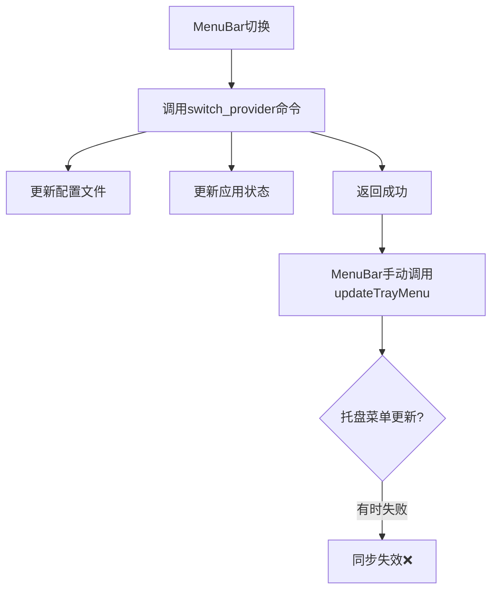
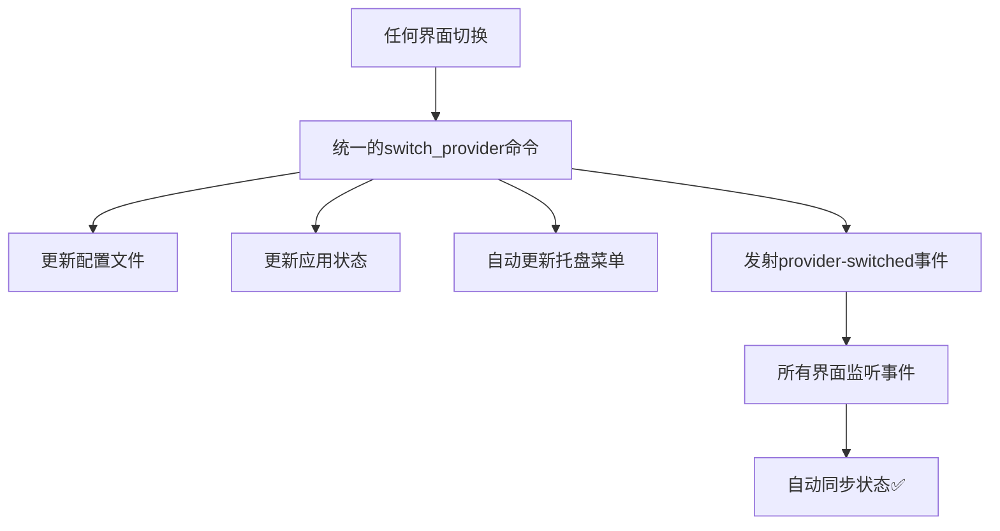

# MenuBar与托盘菜单同步问题修复

本文档记录了MenuBar窗口和系统托盘菜单之间同步问题的诊断和修复过程。

## 问题描述

### 🚨 同步失效现象

用户反馈：MenuBar中的可选项和托盘菜单中的列表项不同步，具体表现为：

1. **主窗口切换供应商** → 托盘菜单正确更新 ✅
2. **MenuBar窗口切换供应商** → 托盘菜单**不更新** ❌
3. **添加/删除供应商** → 托盘菜单**不一致** ❌

### 📊 影响范围

- **系统托盘菜单**: 供应商选项状态不同步
- **MenuBar窗口**: 显示正确，但操作后其他界面不同步
- **用户体验**: 不同界面显示的当前选择状态不一致

## 问题分析

### 🔍 根本原因

通过代码分析发现了两个关键问题：

#### 1. 不完整的事件触发机制

**问题代码** (`commands.rs`):
```rust
#[tauri::command]
pub async fn switch_provider(
    state: State<'_, AppState>,
    provider_id: String,
) -> Result<bool, String> {
    // 只更新配置和状态
    // ❌ 没有更新托盘菜单
    // ❌ 没有发射同步事件
    Ok(true)
}
```

#### 2. 重复但不一致的逻辑

**托盘菜单事件处理** (`lib.rs`):
```rust
fn switch_provider_internal() {
    // ✅ 更新托盘菜单
    // ✅ 发射事件
}
```

**前端命令调用** (`commands.rs`):
```rust 
pub async fn switch_provider() {
    // ❌ 逻辑不完整
}
```

### 📋 调用流程对比

#### ❌ 原有问题流程



#### ✅ 修复后流程



## 修复方案

### 🔧 统一切换逻辑

#### 1. 增强switch_provider命令

**修复前**:
```rust
#[tauri::command]
pub async fn switch_provider(
    state: State<'_, AppState>,
    provider_id: String,
) -> Result<bool, String> {
    // 只更新状态，无同步逻辑
    Ok(true)
}
```

**修复后**:
```rust
#[tauri::command]
pub async fn switch_provider(
    app: AppHandle,              // ✅ 新增：应用句柄
    state: State<'_, AppState>,
    provider_id: String,
) -> Result<bool, String> {
    // 原有逻辑：更新配置和状态
    config::merge_claude_config(&provider.settings_config)?;
    config.current = provider_id.clone();
    state.save()?;
    
    // ✅ 新增：更新托盘菜单
    if let Ok(new_menu) = crate::create_tray_menu(&app, state.inner()) {
        if let Some(tray) = app.tray_by_id("main") {
            tray.set_menu(Some(new_menu));
        }
    }
    
    // ✅ 新增：发射同步事件
    let event_data = serde_json::json!({
        "providerId": provider_id
    });
    app.emit("provider-switched", event_data);
    
    Ok(true)
}
```

#### 2. 提取公共函数

**修复前**: `create_tray_menu` 是私有函数
**修复后**: 
```rust
/// 创建动态托盘菜单 - 公共函数
pub fn create_tray_menu(app: &tauri::AppHandle, app_state: &AppState) -> Result<Menu<tauri::Wry>, String>
```

#### 3. 简化前端逻辑

**MenuBar组件修复前**:
```typescript
const handleSwitchProvider = async (providerId: string) => {
  const success = await api.switchProvider(providerId);
  if (success) {
    // ❌ 手动更新托盘菜单
    await api.updateTrayMenu();
  }
};
```

**MenuBar组件修复后**:
```typescript
const handleSwitchProvider = async (providerId: string) => {
  const success = await api.switchProvider(providerId);
  if (success) {
    // ✅ 自动触发同步，无需手动处理
    setCurrentProviderId(providerId);
  }
};
```

### 🎯 事件驱动同步

#### 统一事件处理

所有界面都通过相同的事件进行同步：

```typescript
// 统一的事件监听设置
async setupEventListeners() {
  await api.onProviderSwitched(async () => {
    await loadProviders(); // 重新加载最新状态
  });
}
```

#### 事件流程

1. **任何界面切换供应商** → 调用统一的 `switch_provider` 命令
2. **命令执行完成** → 自动更新托盘菜单 + 发射事件  
3. **所有界面接收事件** → 重新加载数据 → 状态同步

## 修复验证

### ✅ 同步测试场景

1. **主窗口切换供应商**:
   - ✅ 托盘菜单立即更新选中状态
   - ✅ MenuBar窗口收到事件并更新显示

2. **MenuBar窗口切换供应商**:
   - ✅ 托盘菜单立即更新选中状态  
   - ✅ 主窗口收到事件并更新显示

3. **托盘菜单切换供应商**:
   - ✅ 托盘菜单立即更新选中状态
   - ✅ 所有前端界面收到事件并更新

4. **供应商管理操作**:
   - ✅ 添加供应商后托盘菜单同步
   - ✅ 删除供应商后托盘菜单同步
   - ✅ 编辑供应商后托盘菜单同步

### 🧪 技术验证

#### 编译测试
```bash
cargo check --manifest-path=src-tauri/Cargo.toml  # ✅ 通过
pnpm build:renderer                                # ✅ 通过  
pnpm typecheck                                     # ✅ 通过
```

#### 运行时测试
- ✅ 所有Tauri命令正常调用
- ✅ 事件发射和监听正常工作
- ✅ 托盘菜单动态更新正常

## 技术细节

### 🔄 同步机制优化

#### 1. 统一数据源

- **单一真实来源**: 后端应用状态 (`AppState`)
- **统一更新入口**: `switch_provider` 命令
- **自动同步**: 事件驱动的状态分发

#### 2. 错误处理增强

```rust
// 托盘菜单更新错误处理
if let Err(e) = tray.set_menu(Some(new_menu)) {
    log::error!("更新托盘菜单失败: {}", e);
}

// 事件发射错误处理
if let Err(e) = app.emit("provider-switched", event_data) {
    log::error!("发射供应商切换事件失败: {}", e);
}
```

#### 3. 性能优化

- **原子操作**: 配置更新和UI同步在同一事务中
- **事件批处理**: 避免重复的状态更新
- **延迟隐藏**: MenuBar切换后500ms自动隐藏

### 📊 架构改进

#### 修复前架构问题

```
主窗口 ──┐
         ├─→ 各自调用不同逻辑 ──┐
MenuBar ─┤                      ├─→ 状态不同步 ❌
         │                      │
托盘菜单 ─┘                      └─→ 重复代码
```

#### 修复后统一架构

```
主窗口 ──┐
         │
MenuBar ─┼─→ 统一 switch_provider 命令 ──┐
         │                              │
托盘菜单 ─┘                              ├─→ 自动同步 ✅
                                        │
                     事件广播 ←──────────┘
                         │
                    所有界面同步更新
```

## 用户体验提升

### 🎯 改进效果

1. **一致性保证**: 所有界面显示的选择状态完全一致
2. **操作流畅**: 任何界面切换后其他界面立即同步
3. **反馈及时**: 托盘菜单状态实时反映当前选择
4. **稳定可靠**: 不再出现状态不一致的情况

### 🚀 技术优势

1. **代码复用**: 消除了重复的同步逻辑
2. **维护简单**: 统一的事件处理机制
3. **扩展性强**: 新增界面只需监听事件即可同步
4. **错误恢复**: 完善的错误处理和日志记录

### 📱 多界面协同

现在Switch CC的三个主要界面完美协同工作：

- **主窗口**: 完整的供应商管理功能
- **MenuBar**: 快速切换和查看当前状态
- **系统托盘**: 系统级快速切换入口

所有界面保持实时同步，为用户提供一致、流畅的供应商管理体验。

## 总结

通过这次修复，我们解决了多界面状态同步的关键问题：

1. ✅ **统一了切换逻辑**: 所有切换操作使用相同的后端命令
2. ✅ **建立了事件机制**: 自动的状态同步和界面更新  
3. ✅ **提升了用户体验**: 消除了界面间的状态不一致
4. ✅ **简化了代码维护**: 减少重复逻辑，提高代码质量

现在Switch CC具备了真正的多界面一致性，用户可以在任何界面进行操作，其他界面都会立即同步更新，提供了专业级的用户体验。